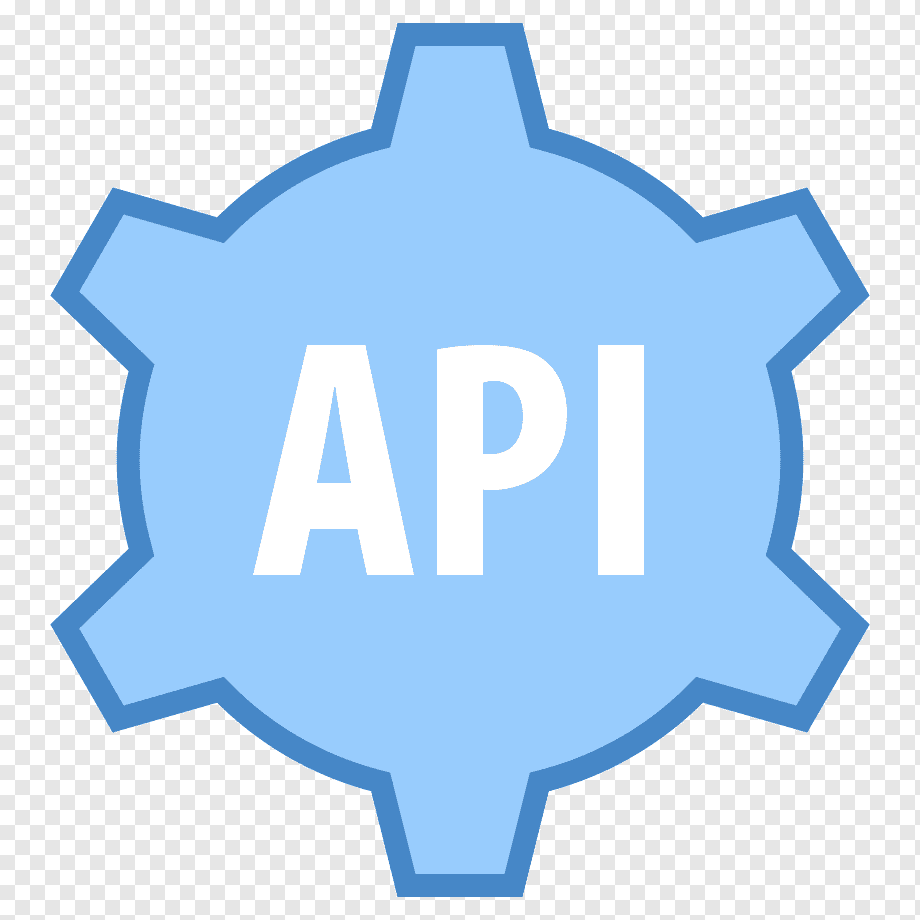
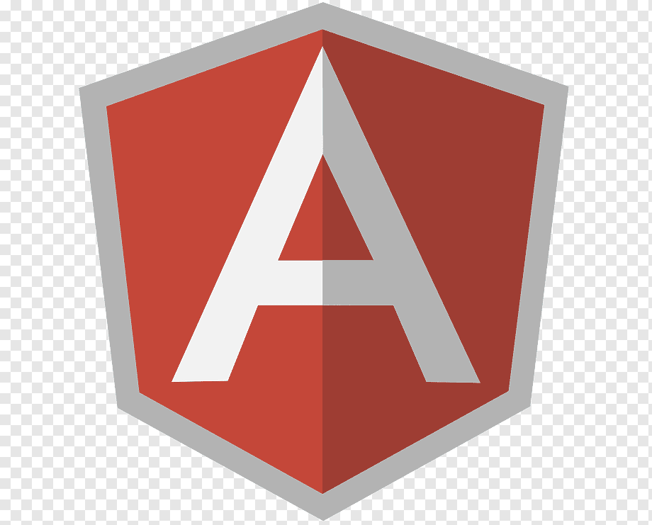
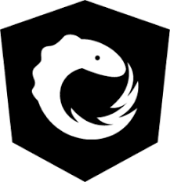
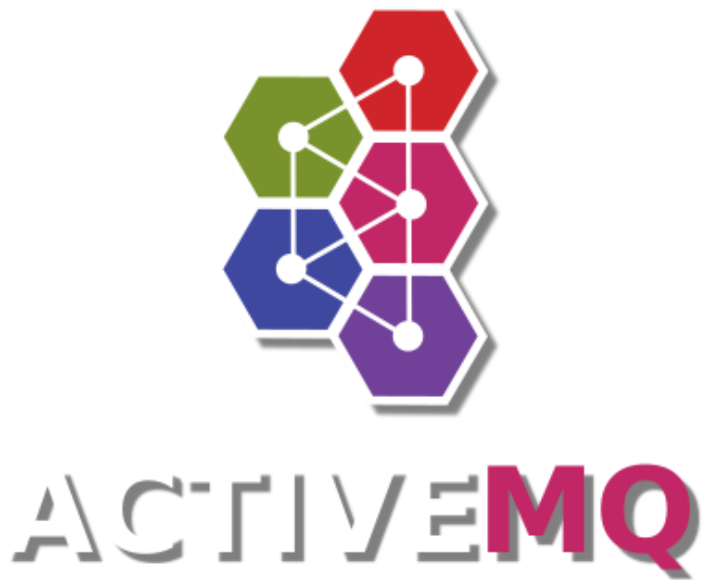

### Hi there 👋, I am Arnab, I am a Bachelor of Computer Science and Engineer

I'm a Full Stack Developer having knowledge in Java Spring Boot, Angular Web App Development, Python for Data Science, Machine Learning.

My objective is to seek a dynamic and challenging career in an organization where I could materialize my professional knowledge and interpersonal skills for the mutual benefit of the organization and myself.

🔭 I’m currently working on my personal and office project.  
🌱 I’m currently learning AWS Cloud Practitioner and revising Data Structure and Algorithm. 
💬 Ask me about OOP, Leadership and Software Engineering. 
📫 How to reach me: palarnab68@gmail.com, Mob: +91 7031092209 

## 🤝 Connect with me.

## 🤖 Technical Skills.

## ✍🏽 Project Links.

 🧑🏽‍💻 <a href="https://github.com/palarnab0707/Ecommerce_Project">Click me</a>
